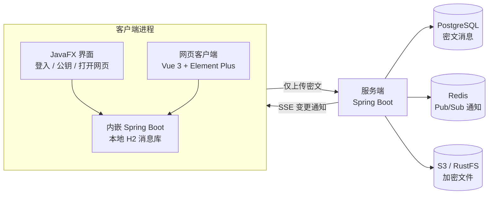
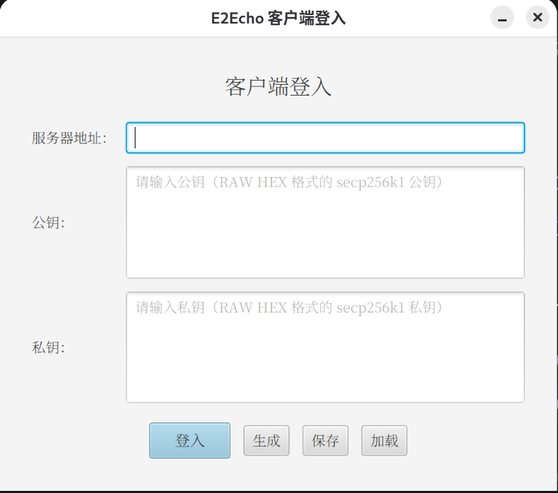
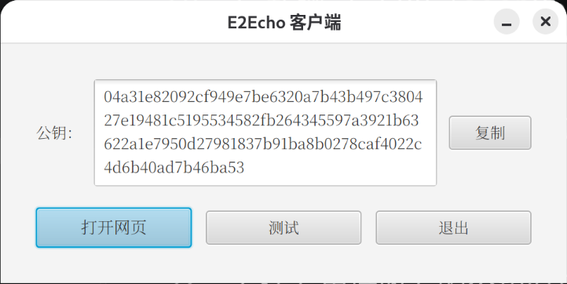
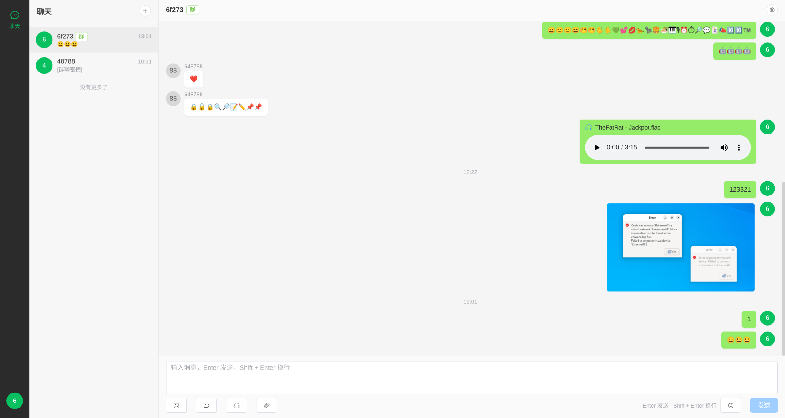

# E2Echo

**端到端加密的即时通讯系统**

私钥即身份 · 服务端只经手密文 · 群聊密钥由群主分发


</div>

## 项目简介

E2Echo 是一套端到端加密（End-to-End Encryption）的即时通讯系统，由**服务端**、**桌面客户端**和**网页客户端**三部分组成。消息在客户端完成加密与签名后才会上传，服务端只负责转发与存储密文，无法读取任何聊天内容。

身份由一对 secp256k1 密钥构成：**公钥就是账号，私钥就是凭据**，不需要手机号、邮箱或密码，也不依赖中心化的账号体系。

## 功能特性

- **端到端加密**：私聊消息用 ECC（secp256k1 ECIES）加密，群聊消息用 AES-256-GCM 加密，加解密只发生在客户端。
- **消息签名防篡改**：每条消息都带 SHA256withECDSA 签名，覆盖除签名本身以外的全部字段，任何改动都会导致验签失败。
- **防重放与防时序攻击**：消息 ID 全局去重，配合时间窗口校验，拒绝历史消息与"未来"消息。
- **群聊密钥分发**：群标识以群主公钥开头，群主生成并轮换 AES 群密钥，通过私聊 ECC 消息分发给成员；新成员入群自动补发密钥。
- **富媒体消息**：支持文字、文件、图片、视频、音频与表情，媒体文件以独立密钥加密后存入对象存储。
- **实时与增量同步**：服务端通过 SSE 长连接推送变更通知（基于 Redis Pub/Sub 支持多实例横向扩展），客户端按 ID 游标增量拉取，不重不漏。
- **两种客户端形态**：JavaFX 桌面客户端负责登入与管理本地加密数据，内嵌 Web 容器同源提供 Vue 3 网页聊天界面。
- **本地数据隔离**：客户端使用本地 H2 文件数据库，消息按登入用户隔离，不同用户互不可见。

## 系统架构



### 模块划分

| 模块                  | 说明                         | 关键技术                                        |
| ------------------- | -------------------------- | ------------------------------------------- |
| `e2echo-ecc`        | 加密核心库，提供 ECC/AES 原语与统一消息载体 | Bouncy Castle、secp256k1、AES-256-GCM         |
| `e2echo-server`     | 服务端，负责消息中转、通知推送与文件对象存储     | Spring Boot Web MVC、PostgreSQL、Redis、S3 SDK |
| `e2echo-client`     | 桌面客户端，负责登入、加解密与本地数据管理      | JavaFX、内嵌 Spring Boot、H2                    |
| `e2echo-client-web` | 网页聊天界面，由客户端内嵌容器同源提供        | Vue 3、TypeScript、Vite、Element Plus          |

## 加密设计

所有加解密与签名都在客户端完成，服务端全程只接触密文。三种场景的加密方式如下：

| 场景                | 正文加密                 | 密钥来源               |
| ----------------- | -------------------- | ------------------ |
| 私聊                | ECC（secp256k1 ECIES） | 直接使用接收方公钥          |
| 群聊                | AES-256-GCM          | 群主生成，经私聊 ECC 消息分发  |
| 文件 / 图片 / 视频 / 音频 | AES-256-GCM（一次性密钥）   | 随消息正文传递，正文再按所处会话加密 |

### 私聊：ECC 加密

发送方用接收方的公钥对正文做 ECIES 加密，再用自己的私钥签名；接收方先验签、再用自己的私钥解密。公钥与私钥均以 RAW HEX 字符串传递，公钥为非压缩点格式（`0x04 || X || Y`）。

### 群聊：AES 群密钥

群标识由"群主公钥 + 随机 ID"拼成，因此从群标识前缀即可判定群主，也只有群主能管理该群。群主生成随机的 AES-256 密钥并通过私聊 ECC 消息分发给成员，成员收到后校验来源确为群主才写入本地。

群消息密文的前 16 位十六进制是**密钥签发时间**（即密钥版本），解密方据此取到同一版本的密钥。密钥可轮换，轮换后旧版本密钥仅在一小段容忍窗口内被接受，超期即拒收。

### 文件：两段式加密

文件本体先用一次性 AES-256-GCM 密钥加密后上传对象存储，再把"文件名 + 密钥 + 对象键"作为消息正文发出，而这条正文本身仍会被对应会话（私聊 ECC / 群聊 AES）加密。服务端只保存密文文件，下载与解密在客户端按需进行，解密完成后即删除临时密文。

### 签名与原文

签名的原文是消息字段按固定顺序（`id`、`from`、`to`、`message`、`type`、`channel`、`info`）序列化出的 JSON，不含 `sign` 字段本身。字段顺序、分隔符与转义规则都被固定下来，保证发送方与接收方对同一条消息得到字节完全一致的原文。消息 ID 由"16 位十六进制时间戳 + 32 位无连字符 UUID"组成，既承载时间信息也保证唯一。

## 安全边界

端到端加密保护的是**内容**，不是全部信息。明确划清边界比笼统宣称"安全"更重要：

**已保护**

- 聊天正文与文件内容：服务端及其存储只能看到密文。
- 消息完整性：签名覆盖除 `sign` 以外的全部字段，篡改任意字段都会导致验签失败。
- 重放与错时序：消息 ID 去重 + 时间窗口校验，历史消息与被篡改时间戳的消息会被拒收。
- 旧密钥滥用：群密钥轮换后，超期仍用旧版本密钥加密的群消息会被拒收。

**已知局限**

- **元数据可见**：服务端能看到收发双方公钥、消息类型、通道、时间戳与密文长度（约等于明文长度），据此可做流量分析。
- **无私钥前向保密**：ECIES 使用接收方静态私钥解密，私钥一旦泄露，历史私聊消息可被解密。
- **身份不可验证**：公钥即身份，但没有目录或信任链，无法证明某个公钥"真的属于某人"，需要线下或其他信道自行核对公钥。
- **私钥即一切**：没有密钥备份与恢复机制，私钥丢失即无法登入，也无法找回历史身份。
- **成员变动依赖手动轮换**：群密钥轮换需要群主主动触发，未轮换前，已离群成员仍持有旧密钥。

> 本项目用于学习与演示端到端加密的工程实现，尚未经过独立安全审计，请勿直接用于生产环境中的敏感通信。

## 界面预览

### 客户端

客户端启动后先登入：填写服务端地址与 ECC 密钥对（可生成、保存、加载），登入成功后进入主界面，在这里复制公钥或打开网页聊天。

| 客户端登入                        | 客户端主界面                        |
|:----------------------------:|:-----------------------------:|
|  |  |

### 网页聊天

网页聊天由客户端内嵌容器提供，与客户端同源，支持文字、文件、图片、视频、音频与表情。



## 快速开始

### 环境要求

| 依赖         | 版本 / 说明                                        |
| ---------- | ---------------------------------------------- |
| JDK        | 21 及以上                                         |
| Maven      | 3.9 及以上（本项目未附带 wrapper）                        |
| PostgreSQL | 服务端消息存储                                        |
| Redis      | 服务端通知的多实例分发                                    |
| S3 兼容对象存储  | 如 [RustFS](https://rustfs.com/)、MinIO；用于存放加密文件 |
| Node.js    | `^22.18.0                                      |

### 1. 构建网页客户端

网页源码位于 `e2echo-client-web`，构建产物会直接输出到客户端的静态资源目录 `e2echo-client/src/main/resources/static/`：

```sh
cd e2echo-client-web
npm install
npm run build
cd ..
```

### 2. 构建服务端与客户端

网页端构建完成后，在项目根目录执行：

```sh
mvn clean package
```

构建产物：

- 服务端：`e2echo-server/target/e2echo-server-1.0-SNAPSHOT.jar`
- 客户端：`e2echo-client/target/e2echo-client-1.0-SNAPSHOT.jar`

> **两步顺序不能颠倒**：网页端不是 Maven 模块（父工程只包含 `e2echo-ecc`、`e2echo-server`、`e2echo-client`），`mvn` 不会构建它。先 `mvn package` 再构建网页，打出的 jar 里就没有网页聊天界面；改动前端后，也要重新 `npm run build` 并重新打包客户端才会生效。

### 3. 启动服务端

服务端默认连接本机的 PostgreSQL、Redis 与对象存储，配置见 [`e2echo-server/src/main/resources/application.yml`](e2echo-server/src/main/resources/application.yml)，均可用环境变量覆盖：

```sh
export SPRING_DATASOURCE_URL='jdbc:postgresql://localhost:5432/e2echo-server'
export SPRING_DATASOURCE_USERNAME='postgres'
export SPRING_DATASOURCE_PASSWORD='postgres'
export SPRING_DATA_REDIS_HOST='localhost'
export S3_ENDPOINT='http://localhost:9000'
export S3_ACCESS_KEY='admin'
export S3_SECRET_KEY='admin'

java -jar e2echo-server/target/e2echo-server-1.0-SNAPSHOT.jar
```

服务默认监听 `8080`。

### 4. 启动客户端

```sh
java -jar e2echo-client/target/e2echo-client-1.0-SNAPSHOT.jar
```

登入界面需要填写**服务器地址**与 **ECC 密钥对**，可直接点"生成"创建新身份，也可以用"保存 / 加载"把密钥对存成 `e2echo-login.json` 复用。登入成功后进入主界面，点"打开网页"即可在系统默认浏览器中开始聊天。

> 网页客户端只能由桌面客户端拉起：客户端会生成一次性票据并打开 `http://localhost:{端口}/auth/{票据}`，服务端校验票据并把当前浏览器会话标记为已登录。因此网页端不能单独登入，也无法脱离客户端独立运行。

## 项目结构

```
E2Echo/
├── e2echo-ecc/            加密核心库：ECC/AES 原语与 EccMessage
├── e2echo-server/         服务端：消息中转、SSE 通知、对象存储
├── e2echo-client/         桌面客户端：JavaFX + 内嵌 Spring Boot + H2
├── e2echo-client-web/     网页客户端：Vue 3 + TypeScript + Vite
├── pom.xml                Maven 父工程
└── LICENSE
```

## 技术栈

| 层次    | 技术                                                                                              |
| ----- | ----------------------------------------------------------------------------------------------- |
| 加密    | Bouncy Castle 1.85、secp256k1、ECIES、ECDSA/SHA-256、AES-256-GCM                                    |
| 服务端   | Spring Boot 4.1.1、Spring Web MVC、虚拟线程、Spring Data JPA、PostgreSQL、Redis、AWS SDK for Java v2 (S3) |
| 桌面客户端 | JavaFX 21、内嵌 Spring Boot、H2、Spring WebClient                                                    |
| 网页客户端 | Vue 3、TypeScript、Vite、Pinia、Element Plus                                                        |
| 构建    | Maven 多模块、npm + Vite（网页端先行构建）                                                                   |

## 许可证

本项目基于 [MIT License](LICENSE) 开源，Copyright (c) 2026 wrx886。
